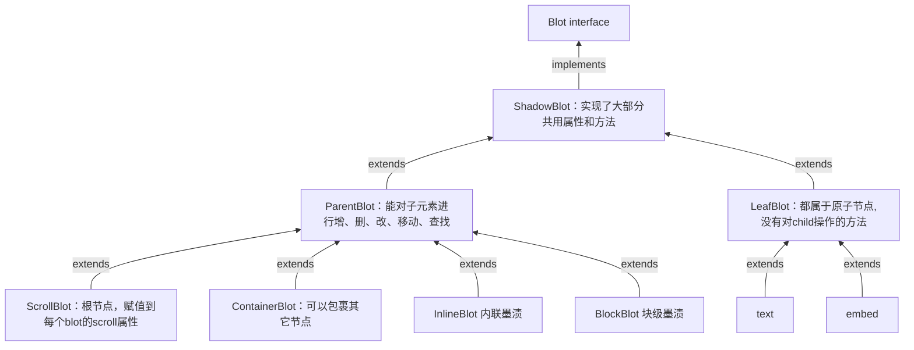

# blot关系


# attributor


# 生命周期


# Registry
```js
class Registry {
    // 维护一个WeakMap，key为domNode，value为blot实例
    public static blots = new WeakMap<Node, Blot>();

    // 通过domNode查找blot实例
    public static find(node?: Node | null, bubble = false): Blot | null
}

```


# 参考文档
<a href="https://zhuanlan.zhihu.com/p/278041642" target="_blank">深入浅出quill</a>